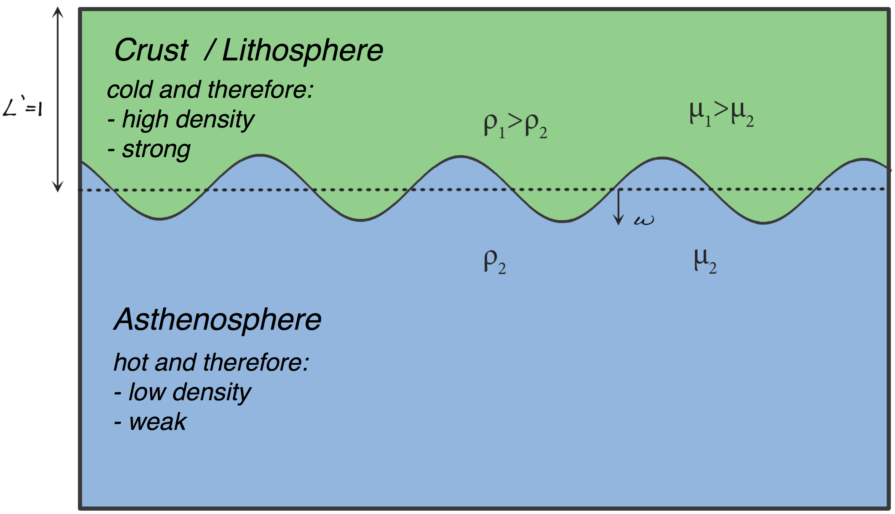

About
-----

This model initialises with an unstable RT configuration, and advects forward in time. 
The ensuing model growth rates are measured and compared against analytically derived results. 

Two different methods are utilised for the derivation of growth rates. In the simpler method, 
a passive tracer is added at the instability interface, and its position in time is then observed
as a proxy for the interface growth. In the second method, the interface itself is captured via
Fourier analysis, with the mode amplitudes then used to measure growth rates. 

This model was originally written by Adam Beall (@adambeall), with additions by John Mansour (@jmansour).  

Files
-----

File | Purpose
--- | ---
`Rayleigh_Taylor_Growth_Rates.ipynb` | The model for RT instability calculation. 

Tests
-----
The perturbation growth rate is measured and compared against analytic results. If it falls outside
a defined tolerance, an exception is raised. 

Parallel Safe
-------------
Yes, test result should be obtained in both serial and parallel operation.

